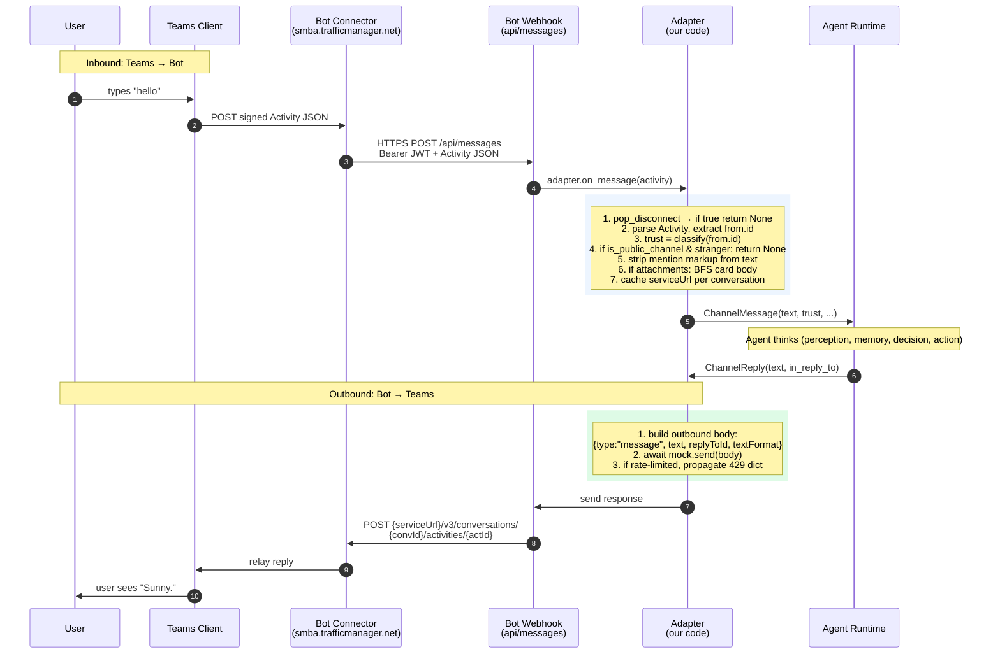

# Microsoft Teams adapter — architecture reference

> Complement to [`README.md`](README.md). The README is the assignment
> brief; this document is the team's reference design — what we build,
> how it fits together, which Bot Framework wire-format quirks we
> handle, and how each of the seven tests maps to a step in the data
> flow.

## What this adapter does

Two methods on `Adapter(ChannelAdapter)`:

- **`on_message(raw)`** — parses an inbound Bot Framework `Activity`
  JSON, classifies trust via `glc.security.trust_level.classify()`,
  gates public-channel access via `glc.security.allowlists.allowed()`,
  strips Teams `<at>...</at>` mention markup, lifts Adaptive Card body
  text via a breadth-first walk, caches the per-conversation
  `serviceUrl` for outbound routing, and returns a typed
  `ChannelMessage`. Returns `None` cleanly on non-`message` Update
  kinds and on a transport-level disconnect.

- **`send(reply)`** — converts a `ChannelReply` into a Bot Framework
  send-Activity body with `type:"message"`, `text`, `replyToId`, and
  `textFormat:"markdown"`. With `config["mock"]` set (the test path) it
  hands the body to the mock; without, it POSTs to the cached
  `serviceUrl` after acquiring an OAuth client-credentials token from
  Microsoft Entra ID.

The canonical envelope contract lives in
[`glc/channels/envelope.py`](../../envelope.py). This adapter does
not redefine those types.

## Layered architecture

```
┌────────────────────────────────────────────────────────────────────┐
│  1. USER ON MICROSOFT TEAMS                                        │
│     Types a message in a 1:1 chat, group, or channel               │
│     Teams client packages as a Bot Framework Activity JSON         │
└──────────────────────────────┬─────────────────────────────────────┘
                               │  Activity JSON + JWT
                               ▼
┌────────────────────────────────────────────────────────────────────┐
│  2. MICROSOFT BOT CONNECTOR (cloud)                                │
│     Regional cluster — smba.trafficmanager.net/{amer|emea|in|...}  │
│     Re-signs JWT, looks up registered bot, POSTs to your webhook   │
└──────────────────────────────┬─────────────────────────────────────┘
                               │  HTTPS POST + Bearer JWT
                               ▼
═══════════════════════════════ BOUNDARY ═══════════════════════════════
     In tests, the Python mock fakes everything above this line.
     The mock just hands the adapter a pre-shaped dict; no network.
══════════════════════════════════════════════════════════════════════
                               │
                               ▼
┌────────────────────────────────────────────────────────────────────┐
│  3. TEAMS ADAPTER — glc/channels/catalogue/teams/adapter.py        │
│                                                                    │
│  ┌─────────────────────────┐    ┌──────────────────────────────┐   │
│  │ on_message(raw)         │    │ send(reply)                  │   │
│  │ ─────────────────────── │    │ ───────────────────────────  │   │
│  │ pop_disconnect          │    │ build {type, text,           │   │
│  │ ↓                       │    │        replyToId,            │   │
│  │ parse Activity          │    │        textFormat}           │   │
│  │ ↓                       │    │ ↓                            │   │
│  │ trust = classify(...)   │    │ mock.send(body)              │   │
│  │ ↓                       │    │ ↓                            │   │
│  │ allowlist gate          │    │ propagate 429 dict unchanged │   │
│  │ ↓                       │    │                              │   │
│  │ strip <at>...</at>      │    │                              │   │
│  │ ↓                       │    │                              │   │
│  │ BFS adaptive card body  │    │                              │   │
│  │ ↓                       │    │                              │   │
│  │ cache serviceUrl        │    │                              │   │
│  │ ↓                       │    │                              │   │
│  │ return ChannelMessage   │    │                              │   │
│  └─────────────────────────┘    └──────────────────────────────┘   │
└─────────────┬──────────────────────────────────┬───────────────────┘
              │ ChannelMessage                  ChannelReply
              ▼                                  ▲
┌────────────────────────────────────────────────────────────────────┐
│  4. NORMALIZED ENVELOPE — glc/channels/envelope.py                 │
│     Pydantic models — SAME shape for every channel                 │
│                                                                    │
│  ChannelMessage(channel, channel_user_id, text, attachments,       │
│                 trust_level, source_id, metadata, ...)             │
│  ChannelReply(channel_user_id, text, in_reply_to, ...)             │
└─────────────┬──────────────────────────────────┬───────────────────┘
              │                                  ▲
              ▼                                  │
┌────────────────────────────────────────────────────────────────────┐
│  5. AGENT RUNTIME (S06–S10 work — unchanged)                       │
│     Perception → Memory → Decision → Action → LLM Gateway          │
└────────────────────────────────────────────────────────────────────┘
```

## Sequence view



## Wire-format quirks

These are the nine concrete Bot Framework wire-format quirks the
adapter handles. Each row references a real wire signal and what
the adapter does about it.

| # | Quirk | Wire signal | Adapter behavior |
|--:|---|---|---|
| 1 | **AAD ID prefixes** | `from.id == "29:42"` for users, `recipient.id == "28:bot-id"` for bots | Read user identity from `from.id` (or prefer `from.aadObjectId` when present, which is tenant-scoped). Compare on id, never on name |
| 2 | **`serviceUrl` is per-conversation, regional** | `serviceUrl: "https://smba.trafficmanager.net/amer/"` — could be `/emea/`, `/in/`, `/apac/` | Cache `(conversation_id → serviceUrl, tenant_id)` on every inbound. Outbound POSTs use this base, not a hard-coded constant |
| 3 | **Reply threading via `replyToId`** | Inbound `id: "act-101"` | Outbound body must set `replyToId: "act-101"` so the reply lands in-thread, not as a new top-level message |
| 4 | **Mention markup in text** | `text: "Hey <at>Bot</at> check this"` plus `entities[].mentioned.id` | Strip `<at>...</at>` markup with `re.sub(r"<at>[^<]*</at>\s*", "", text)` before passing to the agent. Read identity from `entities[].mentioned.id`, never from the stripped text |
| 5 | **Adaptive Card inbound has empty `text`** | `text: ""`, `attachments: [{contentType: "application/vnd.microsoft.card.adaptive", content: {...}}]` | Walk `attachments[*].content.body[]` for the first `TextBlock`. Stash raw card under `metadata["adaptive_card"]` |
| 6 | **Card body is recursively nested** | `body` may contain `Container.items[]`, `ColumnSet.columns[].items[]`, several levels deep | Use BFS to find the shallowest `TextBlock`. A flat scan over `body[]` misses anything inside `Container` or `Column`. DFS would grab a footnote |
| 7 | **Outbound `textFormat`** | Receiver expects `"plain"` \| `"markdown"` \| `"xml"` | Set `textFormat: "markdown"` so `**bold**` actually renders |
| 8 | **Rate limit returns 429 with `retryAfter`** | `mock.send()` returns `{"status": 429, "error": "Throttled", "retryAfter": 2}` | Pass the dict through unchanged. Do not raise. Do not retry inside the adapter |
| 9 | **Disconnect is a sideband flag** | `mock.force_disconnect()` sets a flag; `mock.pop_disconnect()` reads-and-clears | Call `mock.pop_disconnect()` at the top of `on_message`. If True, return `None` rather than raising |

## Adaptive Card body extraction (the behavioural test)

The seventh test is the platform-specific judgment call: when a Teams
user submits an Adaptive Card form, the inbound `text` field is empty
and the user's intent lives inside `attachments[].content.body[]`.

Real Adaptive Cards from production routinely nest `TextBlock`
elements inside `Container` and `ColumnSet` containers. A naive scan
of `body[0]` works for the test fixture (which is flat) but breaks on
real cards. The adapter walks the body **breadth-first** to find the
shallowest `TextBlock` — which is almost always the headline.

### The walk

```python
def _extract_card_text(card_content):
    """Walk an Adaptive Card body breadth-first for the first TextBlock."""
    queue = deque(card_content.get("body", []))
    while queue:
        node = queue.popleft()           # FIFO = breadth-first, O(1)
        if node.get("type") == "TextBlock":
            return node.get("text", "")
        for key in ("items", "columns", "body"):
            children = node.get(key)
            if isinstance(children, list):
                queue.extend(children)
    return ""
```

### What gets stashed

The raw card JSON lives under `ChannelMessage.metadata["adaptive_card"]`
so downstream code that wants the structured form (e.g. re-rendering
a follow-up card) can access it without re-parsing the activity.

### Why BFS, not DFS

BFS finds the shallowest `TextBlock` — the one closest to the root
of the card's `body` array. In real approval cards the primary
message is often a bare `TextBlock` directly in `body[]`, while
footnotes live inside a nested `Container`. BFS reaches that
top-level `TextBlock` before descending into any container. DFS
could enter a `Container` first and return a buried footnote before
ever seeing the top-level `TextBlock`.

References:
- [Adaptive Cards reference (Teams)](https://learn.microsoft.com/en-us/microsoftteams/platform/task-modules-and-cards/cards/cards-reference)
- [Container element](https://adaptivecards.io/explorer/Container.html)

## Trust posture

| Inbound source | `trust_level` set by `classify()` |
|---|---|
| Paired owner identity (see `setup/trust_setup.py --owner`) | `owner_paired` |
| Authenticated user, paired (`setup/trust_setup.py --user`) | `user_paired` |
| Unknown sender / `setup/trust_setup.py --revoke` | `untrusted` |

In a public team channel (`config["is_public_channel"]=True`), the
allowlist gate further enforces `allowed_senders` and
`mention_only_in_public` (default `true`). In public channels,
strangers are either silently dropped (`None`) or passed through with
`trust_level == "untrusted"` — `test_allowlist_silently_drops_stranger_in_public`
accepts both. Pick one and assert it; downstream policy code cannot
safely branch on `msg is None` if the behavior is undefined.

The trust level is the **first** field the policy engine inspects on
the envelope; the adapter never reaches into the policy engine
itself. See
[`glc/security/trust_level.py`](../../../security/trust_level.py) for
the classifier and `policy.yaml` at the repo root for the rules.

## Field mapping (external ↔ internal)

### Inbound: Activity JSON → ChannelMessage

| Microsoft Activity field | ChannelMessage field | Transformation |
|---|---|---|
| `from.id` (e.g. `"29:42"`) | `channel_user_id` | Direct copy; string compare against bonded owner id |
| `from.name` | `user_handle` | Direct copy |
| `text` (may be `""`) | `text` | If empty AND Adaptive Card attachment present → BFS card body; strip `<at>...</at>` markup |
| `attachments[]` | `attachments[]` (filtered) | AdaptiveCard → `metadata["adaptive_card"]`; image/file attachments mapped to `Attachment(kind, ref, mime)` |
| `id` | `source_id` | Direct copy — needed later for outbound `replyToId` |
| `serviceUrl` | `metadata["service_url"]` | Cache per conversation for outbound routing |
| `conversation.id` | `metadata["conversation_id"]` | Cache per conversation |
| `entities[].mention` | `metadata["mentions"]` (optional) | Stash structured mentions |
| (computed) | `trust_level` | From `classify("teams", channel_user_id)` |
| (computed) | `arrived_at` | Parse `timestamp` if present, else `datetime.now(UTC)` |
| (constant) | `channel` | `"teams"` |

### Outbound: ChannelReply → Activity JSON

| ChannelReply field | Activity JSON field | Transformation |
|---|---|---|
| `text` | `text` | Direct copy |
| `in_reply_to` | `replyToId` | Direct copy (camelCase on the wire) |
| `channel_user_id` | (routing only) | Look up cached `serviceUrl` and `conversation_id` |
| (constant) | `type` | `"message"` |
| (constant) | `textFormat` | `"markdown"` |

## How the seven tests map to this architecture

Open `tests/channels/test_teams.py` and follow along.

| # | Test | Type | Step in the architecture | What it asserts |
|--:|---|---|---|---|
| 1 | `test_on_message_owner_returns_valid_envelope` | Structural | Layer 3 `on_message`, steps 2-4 | Owner AAD `29:42` returns `ChannelMessage(channel="teams", trust_level="owner_paired", text="hello from owner")` with a real `datetime` `arrived_at` |
| 2 | `test_on_message_stranger_is_untrusted` | Structural | Layer 3 `on_message`, step 4 | Stranger AAD `29:999` returns `ChannelMessage(trust_level="untrusted")` — not dropped |
| 3 | `test_send_emits_valid_wire_payload` | Structural | Layer 3 `send`, full body shape | Outbound `mock.send_log` has one entry with `type:"message"`, `text:"hi back"`, `replyToId:<inbound id>` |
| 4 | `test_disconnect_is_handled` | Structural | Layer 3 `on_message`, step 1 | After `mock.force_disconnect()`, `on_message` must not raise |
| 5 | `test_rate_limit_propagates_429` | Structural | Layer 3 `send`, step 3 | When `mock.rate_limited=True`, `send` returns a dict with `status == 429` |
| 6 | `test_allowlist_silently_drops_stranger_in_public` | Structural | Layer 3 `on_message`, step 4 (public-channel branch) | With `is_public_channel=True`, stranger event yields `msg is None` or `trust_level == "untrusted"` |
| 7 | `test_channel_specific_behaviour_adaptive_card` | **Behavioural** | Layer 3 `on_message`, step 6 (BFS card body) | Inbound has `text:""` and an attachment with `contentType: "application/vnd.microsoft.card.adaptive"`. Adapter must BFS the card body, lift the first `TextBlock` into `msg.text`, stash the raw card under `msg.metadata["adaptive_card"]` |

## Wire-format references

- [Bot Framework Connector REST API](https://learn.microsoft.com/en-us/azure/bot-service/rest-api/bot-framework-rest-connector-api-reference)
- [Create messages](https://learn.microsoft.com/en-us/azure/bot-service/rest-api/bot-framework-rest-connector-create-messages)
- [Authentication](https://learn.microsoft.com/en-us/azure/bot-service/rest-api/bot-framework-rest-connector-authentication)
- [Teams channel and group conversations](https://learn.microsoft.com/en-us/microsoftteams/platform/bots/how-to/conversations/channel-and-group-conversations)
- [Cards reference](https://learn.microsoft.com/en-us/microsoftteams/platform/task-modules-and-cards/cards/cards-reference)
- [Rate limiting for bots](https://learn.microsoft.com/en-us/microsoftteams/platform/bots/how-to/rate-limit)

## Honest limits

1. **The real wire path is untested against a live Microsoft 365
   tenant.** The CI suite exercises the mock path only. The Microsoft
   365 Developer Program tightened its policy in late 2025 and free
   developer tenants are no longer easily available. Verify against
   current Microsoft auth docs before relying on the real OAuth path
   in production.

2. **Multi-tenant bot registrations are deprecated.** Microsoft
   stopped allowing new multi-tenant Bot Service registrations after
   2025-07-31. The OAuth code targets the single-tenant endpoint and
   requires `TEAMS_TENANT_ID` accordingly.

3. **Out of scope for the structural rubric** — slash commands,
   inline keyboards, threaded edits, task modules, tab/messaging
   extensions, Adaptive Card `Action.Execute` invoke roundtrips,
   SSO. Each is implementable as an extension to `on_message` /
   `send` but adds complexity beyond what the test contract
   asserts.

## Contributors

- Abhinav Rana ([@levelscorner](https://github.com/levelscorner)) — architecture documentation
